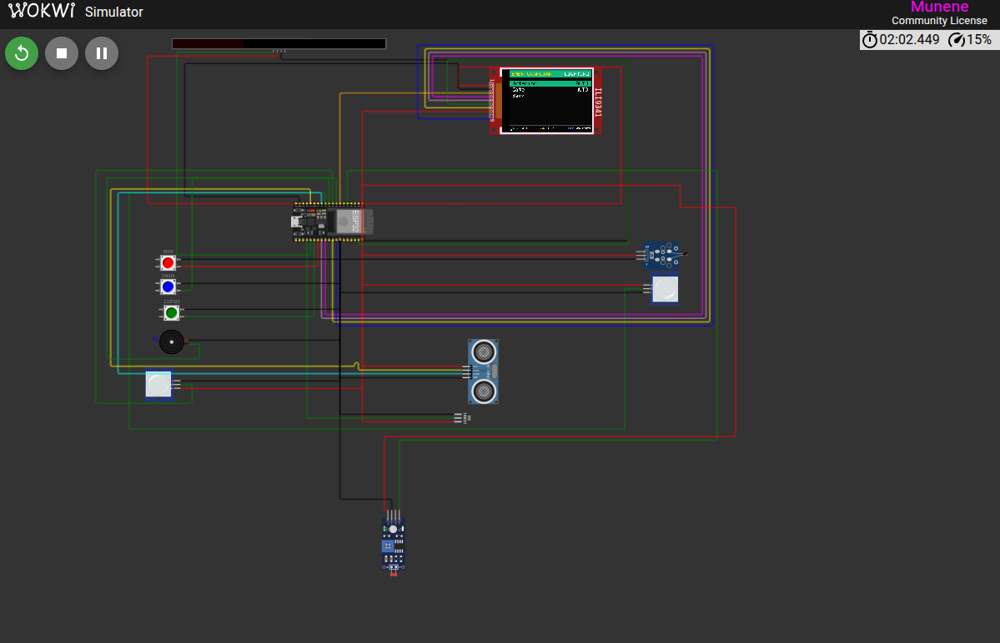

# SPI — ESP32 Learning Bench + Home-Guardian Capstone

A PlatformIO monorepo of ten ESP32 mini-projects built around the **SPI**
bus, culminating in a capstone home-security + smart-lighting kiosk that
ties every technique together on one board.

Sibling to the [I2C repo](https://github.com/MUNENE1212/I2C).

---

## Capstone: EMEN Home Guardian



`src/10_home_guardian/` — a full interactive security panel driven by
seven sensors, three buttons, a WS2812 accent strip, a piezo buzzer, a
microSD card, and an ILI9341 TFT with a menu-driven UI. Every technique
from projects 01–09 shows up here.

**Highlights:**
- 4-state alarm engine — DISARMED / ARMED_HOME / ARMED_AWAY / ALARM
- **Time-aware** logic (LDR proxies day/night) — no false daytime alarms
- **Safety triggers** (gas, fire) always fire regardless of arm state
- **Energy-first lighting** — no security light burns unnecessarily:
  motion-gated, LDR-gated, with fade-in / hold / fade-out ramps
- **Full-duplex operator UI** — live sensor dashboard on the TFT, plus
  a menu system for control, tuning, and event review, all driven by
  three hardware buttons with short + long press semantics
- **SD event + environment log** with an on-screen ring buffer for
  reviewing recent events without a serial cable

Read the design in the header of
[`src/10_home_guardian/main.cpp`](src/10_home_guardian/main.cpp).

---

## The ten mini-projects

| # | Folder | Hardware | Focus |
|---|---|---|---|
| 1 | `01_max7219_hello` | 12× MAX7219 (8×96 px) | First SPI. `MD_MAX72XX` + `MD_Parola`, rotating EMEN advert |
| 2 | `02_hello_tft` | ST7735 128×160 TFT | Adafruit_GFX primitives on a color surface |
| 3 | `03_sd_card` | MicroSD slot | ESP32 `SD.h` + `FS.h` — mount, write, read, list |
| 4 | `04_shift_register` | 74HC595 + 8 LEDs | Raw SPI without a peripheral library; WALK + CYLON |
| 5 | `05_rfid_mfrc522` | MFRC522 RFID | Poll for tags, print UID over Serial, blink confirm LED |
| 6 | `06_ws2812_signboard_spi` | 8×64 WS2812 matrix | **SPI-MOSI abused as WS2812 timing generator** — 4-bit encoding at 3.2 MHz |
| 7 | `07_ws2812_status_rmt` | 24-LED WS2812 ring | Native RMT driving; five rotating status animations |
| 8 | `08_ws2812_advert_rmt` | 8×64 WS2812 matrix | RMT + a **color-style engine**: SOLID, RAINBOW, PALETTE, BREATHE, SPARKLE, BLINK, ALTERNATE |
| 9 | `09_tft_dashboard` | ILI9341 320×240 TFT | EMEN services showcase with hand-drawn icons + bouncing-wordmark screensaver |
| **10** | **`10_home_guardian`** | ESP32 + 7 sensors + LEDs + TFT + SD + buttons | **Capstone: security + smart lighting panel** |

---

## Why a whole repo for SPI?

I²C addresses devices by a 7-bit number on a shared 2-wire bus.
SPI selects the target with a dedicated **CS** line and streams bits
synchronously over **MOSI + MISO + SCK**. That gives:

- **Higher clock rates** than I²C (tens of MHz on ESP32) — good for
  displays, SD cards, dense pixel data.
- **No arbitration** — one master talks to whichever peripheral has its
  CS pulled low. Chained devices (MAX7219 modules) share MOSI/CLK and
  pass data down the chain.
- **Framing freedom** — every peripheral defines its own byte protocol
  on top of the raw SPI transfer.

Projects 06 and 07 explicitly compare **SPI-abused-as-NRZ** vs
**native-RMT** driving of the same WS2812 chip family — same LEDs, very
different code, very different pin freedom.

---

## Technologies

**Microcontroller:** ESP32 (Espressif dual-core Xtensa LX6, 240 MHz,
520 KB SRAM, integrated Wi-Fi + Bluetooth).
Wokwi part: `board-esp32-devkit-c-v4`.

**Toolchain:**
- [PlatformIO](https://platformio.org/) build system
- Arduino framework for ESP32 (`framework-arduinoespressif32`)
- [Wokwi](https://wokwi.com/) simulator (per-project `diagram.json` +
  `wokwi.toml`)

**ESP32 peripherals exercised:**

| Peripheral | Where |
|---|---|
| **SPI** (VSPI: SCK=18, MOSI=23, MISO=19) | TFT, MAX7219, microSD, 74HC595, MFRC522, WS2812 (proj 06) |
| **I²C** (SDA=21, SCL=22) | BMP180 |
| **1-Wire** (any GPIO + 4.7 kΩ pull-up) | DS18B20 |
| **RMT** | WS2812 native timing |
| **LEDC** (PWM) | Piezo buzzer tone generation |
| **ADC1** (input-only GPIO 34–39) | LDR, MQ2, NTC |

**Sensors and displays across the ten projects:**
- MAX7219 8×8 LED matrix modules (chainable)
- WS2812 addressable RGB LEDs (single-wire NRZ 800 kHz)
- ST7735 128×160 SPI TFT
- ILI9341 240×320 SPI TFT
- MicroSD card
- 74HC595 shift register
- MFRC522 RFID reader
- HC-SR04 ultrasonic distance
- PIR motion sensor
- MQ2 gas / smoke sensor
- DS18B20 1-Wire temperature
- Analog NTC thermistor (10 kΩ, β=3950)
- LDR photoresistor
- BMP180 barometric pressure (I²C)
- Piezo buzzer

**Arduino libraries used:**
- `majicdesigns/MD_Parola`, `majicdesigns/MD_MAX72XX`
- `adafruit/Adafruit GFX Library`, `adafruit/Adafruit BusIO`
- `adafruit/Adafruit ST7735 and ST7789 Library`
- `adafruit/Adafruit ILI9341`
- `adafruit/Adafruit NeoPixel`
- `adafruit/Adafruit BMP085 Library` (drives the BMP180 too)
- `paulstoffregen/OneWire`, `milesburton/DallasTemperature`
- `miguelbalboa/MFRC522`
- `SD`, `FS`, `Wire`, `SPI`, `esp_log` — bundled with ESP32 Arduino core

---

## Repo layout

```
.
├── platformio.ini
├── README.md
├── LICENSE
├── capstone.png                    the screenshot at the top of this README
├── include/                        shared header-only helpers
│   ├── spi_pins.h                  SPI_SCK_PIN, SPI_MOSI_PIN, SPI_MISO_PIN
│   ├── emen_serial.h               logBoot() — consistent Serial banner
│   └── emen_brand.h                RGB565 EMEN palette (green / gold / blue / greys)
├── src/
│   ├── 01_max7219_hello/           MAX7219 marquee
│   ├── 02_hello_tft/               ST7735 splash
│   ├── 03_sd_card/                 SD read/write/list
│   ├── 04_shift_register/          74HC595 raw SPI
│   ├── 05_rfid_mfrc522/            RFID reader
│   ├── 06_ws2812_signboard_spi/    WS2812 via SPI-MOSI trick
│   ├── 07_ws2812_status_rmt/       WS2812 ring via RMT
│   ├── 08_ws2812_advert_rmt/       WS2812 sign with color styles
│   ├── 09_tft_dashboard/           ILI9341 services kiosk + screensaver
│   └── 10_home_guardian/           capstone security + smart lighting
└── .gitignore
```

Every project folder ships three files: `main.cpp`, `diagram.json`,
`wokwi.toml`.

---

## Capstone deeper dive (10_home_guardian)

**Sensors → responsibilities:**

| Sensor | Bus / interface | Job |
|---|---|---|
| HC-SR04 | GPIO (TRIG + ECHO) | Gate open detection (distance < 100 cm) |
| PIR outdoor | GPIO | Yard motion |
| PIR indoor | GPIO | Interior motion — auto-lighting trigger |
| MQ2 | ADC1 | Gas / smoke — safety alarm |
| DS18B20 | 1-Wire | Primary temperature — fire proxy (> 45 °C) |
| NTC (10 kΩ) | ADC1 | Secondary comfort temperature |
| LDR | ADC1 | Ambient light — day/night proxy with hysteresis |
| BMP180 | I²C | Barometric pressure — environment log |

**Outputs → responsibilities:**

| Output | Interface | Role |
|---|---|---|
| WS2812 24-px strip | RMT | 4 logical zones: alarm (0–7), perimeter (8–14), gate indicator (15), interior (16–23) |
| Piezo buzzer | LEDC | Alarm sounds — 800 Hz intrusion / 1200 Hz gas / 2000 Hz fire |
| ILI9341 TFT | SPI | Operator console (dashboard + menus) |
| MicroSD | SPI | `/env.csv` every 60 s, `/events.csv` on every event |

**Operator controls (3 buttons):**

| Button | Short press | Long press (≥ 800 ms) |
|---|---|---|
| ARM | cycle arm state | disarm / reset alarm — panic-disarm from any screen |
| MENU | next menu item / +step in editor | back / -step in editor |
| SELECT | enter / confirm | back / cancel |

**Eight UI screens:** HOME dashboard → MAIN menu → { ARM MODE,
LIGHTING CONTROL, THRESHOLDS → EDIT_VALUE, RECENT EVENTS, SYSTEM INFO }.

**Time-aware alarm rules** (LDR = day/night proxy with hysteresis so
dusk doesn't flap the state):

| Trigger | DISARMED | ARMED_HOME | ARMED_AWAY |
|---|---|---|---|
| PIR outdoor | log | **ALARM** | **ALARM** |
| PIR indoor | log; night → light | log | **ALARM** |
| Gate open (HC-SR04) | log | **ALARM at night** | **ALARM** always |
| MQ2 spike | **ALARM** | **ALARM** | **ALARM** |
| DS18B20 > 45 °C | **ALARM** | **ALARM** | **ALARM** |

Day-time indoor PIR while ARMED_HOME does *not* alarm — residents are
home and moving around is expected. Night-time gate opens always alarm
in ARMED_HOME. Safety triggers ignore mode and time entirely.

**Energy policy for lighting:**
- Default state: everything off.
- Interior zone: 0.5 s fade-in on PIR + night, holds 30 s from last
  motion, 3 s fade-out ramp. Any motion during the fade snaps back to
  full and resets the timer.
- Gate indicator: instant on / instant off, 60 s hold (security fixture).
- Perimeter zone: dim state-color heartbeat (5/255) + 100 ms bright flash
  every 10 s as system-alive indicator.
- Estimated **≈87 % energy reduction** vs an always-on 24-LED strip.

---

## Pin map — capstone (10_home_guardian)

| GPIO | Signal | GPIO | Signal |
|---|---|---|---|
| 0  | SELECT button (internal pull-up) | 22 | I²C SCL (BMP180) |
| 2  | WS2812 strip (RMT)               | 23 | SPI MOSI |
| 4  | ARM button                       | 25 | PIR outdoor |
| 5  | SD CS                            | 26 | Buzzer (LEDC ch 4) |
| 13 | HC-SR04 TRIG                     | 27 | PIR indoor |
| 14 | HC-SR04 ECHO                     | 32 | TFT CS |
| 15 | DS18B20 (1-Wire, 4.7 kΩ pull-up) | 33 | MENU button |
| 16 | TFT D/C                          | 34 | LDR (ADC1, input-only) |
| 17 | TFT RST                          | 35 | MQ2 (ADC1, input-only) |
| 18 | SPI SCK                          | 36 | NTC (ADC1, input-only) |
| 19 | SPI MISO                         |    | |
| 21 | I²C SDA (BMP180)                 |    | |

### Pin gotchas encountered along the way

- **GPIO 34, 35, 36, 39** — input-only ADC1 pins. Great for analog
  sensors, but **no internal pull-up/pull-down**. `INPUT_PULLUP` on
  these is silently a no-op. Never wire a button to them. The capstone
  deliberately uses GPIO 0 for SELECT after discovering GPIO 39 doesn't
  work for buttons.
- **GPIO 0 & 12** — boot-strapping pins. GPIO 0 must be HIGH at boot
  (which `INPUT_PULLUP` provides), so it's safe for buttons. GPIO 12
  must be LOW at boot — avoid `INPUT_PULLUP`.
- **`tone()` / `noTone()`** on ESP32 use the LEDC peripheral. Calling
  `noTone()` before any `tone()` throws "LEDC not initialised" errors
  on every tick. The capstone allocates LEDC channel 4 explicitly with
  `ledcSetup` + `ledcAttachPin` and uses `ledcWrite` / `ledcWriteTone`
  directly.
- **Wokwi microSD** needs a card image loaded through the sim UI. The
  code silences `sd_diskio` at ERROR level so an empty slot doesn't
  spam Serial; `sdReady = false` disables log writes gracefully.

---

## Shared conventions

- **Shared helpers in `include/`** — brand colors (`emen_brand.h`), boot
  banner (`emen_serial.h`), SPI pin defs (`spi_pins.h`). No copy-paste
  across projects.
- **`millis()`, not `delay()`** — every loop is non-blocking so sensors,
  alarms, lighting, and UI all tick without stalling each other.
- **Explicit stdint types** (`uint8_t`, `uint32_t`) instead of Arduino's
  `byte` / `unsigned long`.
- **Comments explain WHY** — the code files are the documentation.
  Header comments summarize the design; inline comments cover
  non-obvious decisions and the rationale for magic numbers.
- **One `[env:...]` per project** — builds and lib deps stay isolated.

---

## Building & simulating

```
pio run -e 10_home_guardian           # build one env
pio run                               # build every env
pio run -e 03_sd_card -t upload       # flash a physical board
```

**Wokwi (recommended for exploration):** open `src/<project>/` in VS
Code with the Wokwi extension installed, then run
**Wokwi: Start Simulator**. The extension picks up the local
`wokwi.toml` and `diagram.json` automatically.

---

## Adding a new mini-project

1. Create `src/NN_name/` with `main.cpp`, `diagram.json`, `wokwi.toml`.
2. Point `wokwi.toml` at `../../.pio/build/NN_name/firmware.{bin,elf}`.
3. Append to `platformio.ini`:
   ```ini
   [env:NN_name]
   build_src_filter = +<NN_name/>
   lib_deps =
       ; libraries this project uses
   ```
4. In `main.cpp`, `#include "emen_serial.h"` and call
   `logBoot("NN_name")` in `setup()` for a consistent boot log.

---

## Credits

Built by **[Munene](https://github.com/MUNENE1212)** as part of the
EMEN Engineering learning bench, alongside the sibling
[I2C repo](https://github.com/MUNENE1212/I2C).

## License

MIT — see [`LICENSE`](LICENSE).
